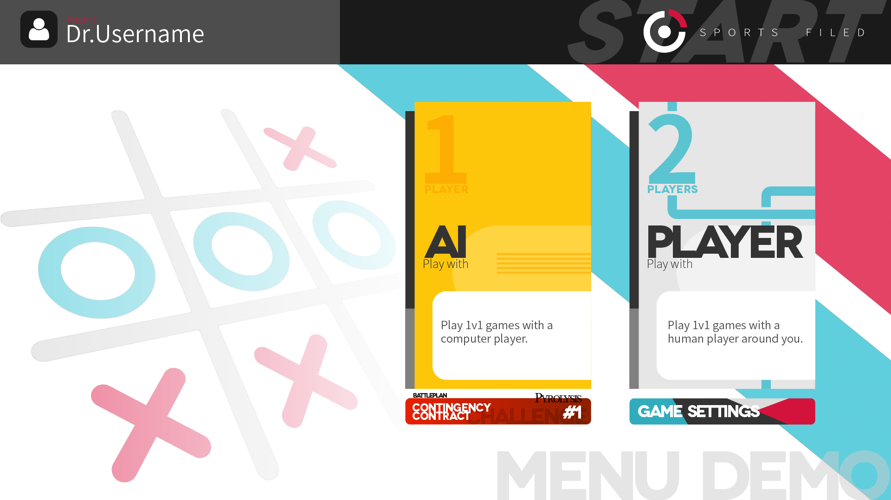

# Tic-Tac-Toe

A Tic-Tac-Toe game in the art style of Arknights RHODES ISLAND ICEBREAKER GAMES made with Astro and JavaScript.

**Concept design artwork:**

## Development Plan

 - [ ] Complete the gameplay system.
   - [x] Complete basic Tic-Tac-Toe gameplay.
   - [ ] Innovative gameplay.
   - [ ] Complete Arknights character system.
   - [ ] Complete Challenge System (BATTLEPLAN Contingency Contract).

# Thanks

 - **Astro web framework documentation:** Use web framework to better plan and optimize the web front-end.
   - “Project Structure | Docs.” Astro Docs, https://docs.astro.build/en/basics/project-structure/. Accessed 24 May 2024.
 - **Art resources(Non-commercial):** Enrich game pages and gameplay.
   - “干员一览.” PRTS, 9 August 2023, https://prts.wiki/w/%E5%B9%B2%E5%91%98%E4%B8%80%E8%A7%88. Accessed 24 May 2024.

# Produced by
 - [MOEQY](https://www.moeqy.com/)
 - [CONCEPTS GAME](https://www.moeqy.com/conceptsgame/)
